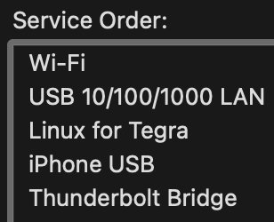

# Adaptik Robot Arm

TODOs:
- [ ] calibrate servo home positions and limits (most gruesome part of tomorrow) (should it be vertical? how do we allot it 270 range?)
- [ ] Tune max_vel and max_accel of servos
- [ ] Add in parameter to Servo class for custom max_vel and max_accel fields (to be tweaked in ServoController.py). Reason? Lower joints may need lower maxes than later joints
- [ ] may need to add in additional delays, specificlaly worried about move_in_synced where motion profiles are reset after move_to_pos

## NVIDIA Jetson Nano Setup

The NVIDIA Jetson Nano we are using is model *P3450*, the *B01* developer kit. This kit will not work with the latest version of the SDK, so we will use V46's image. The following setup guide is for Mac ARM64 and intended to be completed in one sitting with no interruptions. Setup should take around 1hr 30min:

### Writing Jetpack SDK Ubuntu Image to MicroSD Card

1. Download the [ZIP Archive](https://developer.nvidia.com/embedded/l4t/r32_release_v6.1/jeston_nano/jetson-nano-jp46-sd-card-image.zip)
2. Download [Etcher](https://github.com/balena-io/etcher/releases/download/v1.19.25/balenaEtcher-1.19.25-arm64.dmg)
3. Install and open *balenaEtcher*

4. Click **Flash from File**
5. Select *Jetson Nano SD Card Image.zip* from your Downloads


> Make sure Etcher displays "sd-blob-b01.img" as the image
6. Plug in a MicroSD card with at least 32GB of space (64GB preferred) to your computer
> If you see a Mac error saying the card could not be read properly, press **Ignore**
7. Click **Select Target** in Etcher and select your MicroSD card (no need to remove old files from your SD card, Etcher will overwrite it)
8. Click **Flash** and wait (Write + Validation time takes ~20 minutes)
9. You should see a Mac popup asking to eject. Click **Eject** and remove the SD Card adapter from your computer

### Booting up the Jetson

1. Grab (don't plug in yet) a 5V/4A power supply (3A will work too) into the bottom left circular port on the board.
2. Plug in your peripherals
    a. Keyboard
    b. Mouse
    c. HDMI/Display to an external monitor
    d. Do NOT plug in Ethernet just yet
3. Now plug in the power supply to the board
4. The booting process should take only a couple of minutes
> A common error is the ["End-user configuration start job runs endlessly"](https://forums.developer.nvidia.com/t/first-boot-endlessly-in-a-start-job-is-running-for-end-user-configuration/158015). If this happens, reflash and try again. Make sure you **Eject** the card properly
5. Ubuntu should load and ask you to setup a *User Profile*
    a. Enter your full name
    b. For *Username*, enter **nvidia**. Computer name should generate as *nvidia-desktop*. Keep that name
    c. Enter a Sudo password that is easy to remember (we will need this to run Sudo commands and SSH into the board later)
    c. Click through the rest with default settings
#### Enable Ethernet Communication between Mac and Jetson
1. Open System Preferences > Three dots in bottom right > Set Service Order > Drag "Wi-Fi" above "USB 10/100/1000 LAN"

2. Open System Preferences > Internet Sharing > Toggle ON | Confirm "Share your connection from" is set to *Wi-Fi*
3. Plug in your Ethernet cable into your Mac with a LAN -> USB adapter
4. Plug in the other end of the Ethernet cable into the Jetson
5. Open the **Terminal** application on Ubuntu and run the following scripts to enable SSH. Enter your User password for Sudo when prompted:
```bash
sudo apt update
sudo apt install openssh-server
sudo systemctl enable ssh
sudo systemctl start ssh
ifconfig
```
6. From ifconfig, look for the "Ethernet" paragraph and find the IP address of the Jetson next to "inet", which should be similar to 192.168.2.2. Hold onto this for later!
### Allow GPIO Permissions
1. Still in **Terminal**, run the following bash commands to enable IO with the GPIO pins on your board:
```bash
sudo groupadd -f -r gpio
sudo usermod -a -G gpio $user
exit
```
2. You will be signed out of Ubuntu to let the group changes take effect. Log back in and reopen terminal
#### Install a newer version of Python
1. Run the following Python commands. The make step will take ~45 minutes:
```bash
sudo apt install -y build-essential libncursesw5-dev libssl-dev libsqlite3-dev tk-dev libgdbm-dev libc6-dev libbz2-dev libffi-dev zlib1g-dev
tar -xf Python-3.9.16.tgz
cd Python-3.9.16
./configure --enable-optimizations
make -j4
sudo make altinstall
sudo update-alternatives --install /usr/bin/python python /usr/local/bin/python3.9 1
sudo update-alternatives --install /usr/bin/python3 python3 /usr/local/bin/python3.9 1
sudo apt-get update
sudo apt-get install python3-pip
```
2. Verify successful installation with:
```bash
python --version
python3 --version
```
#### Create udev rules for Jetson
1. Change udev rules (will open editor window in terminal)
```bash
sudo nano /etc/udev/rules.d/99-gpio.rules
```
2. Paste these lines into the file
```bash
SUBSYSTEM=="gpio", KERNEL=="gpiochip*", ACTION=="add", GROUP="gpio", MODE="0660"
SUBSYSTEM=="gpio", KERNEL=="gpio*", ACTION=="add", GROUP="gpio", MODE="0660"
```
3. **Ctrl-X -> Y -> ENTER** to save changes
4. Reboot your jenson
```bash
sudo reboot
```
### Set this repository up from your Mac's VSCode
1. Open Visual Studio Code on your Macbook
2. Click "Remote Explorer" on the left sidebar in the application
3. Select the topmost dropdown and click **Remotes (Tunnels/SSH)
4. Hover over the SSH menu and click the **plus** on the right
5. Enter the address with the IP you saved from earlier like below:
```
ssh nvidia@192.168.2.2
```
6. Click enter and when prompted for a config file, select the topmost option (should be in your Mac user)
7. Open in a new Window and enter the Sudo password to access your Jetson computer
8. Create a **Terminal** in VSCode and cd into *Documents*
9. Run the following commands with the URL of this repository to download our code:
```bash
git clone <this-github-repository.git>
cd <this-github-repository-name>
python3.9 -m venv venv
source venv/bin/activate
pip install -r requirements.txt
```
10. All done!
> To run the `main.py` file, enter the following in your terminal while in `(venv)`:
```bash
python3 robot/main.py
```