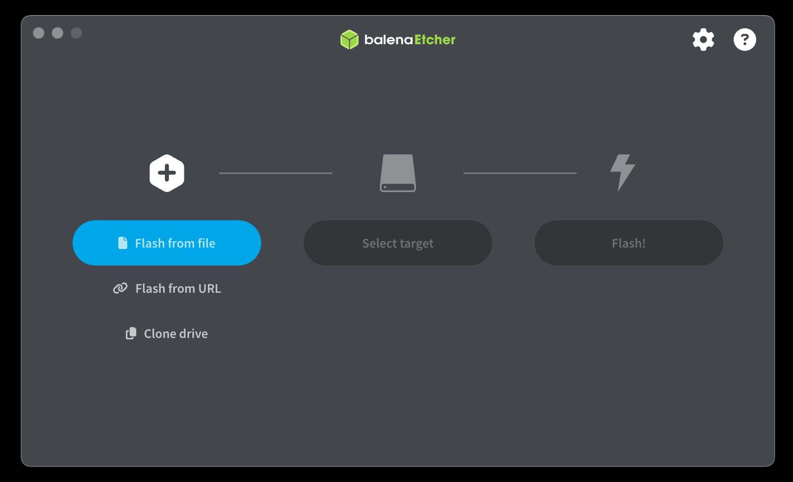
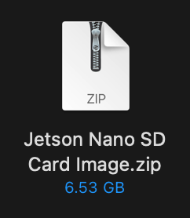

# Adaptik Robot Arm

TODOs:
- [ ] calibrate servo home positions and limits (most gruesome part of tomorrow) (should it be vertical? how do we allot it 270 range?)
- [ ] Tune max_vel and max_accel of servos
- [ ] Add in parameter to Servo class for custom max_vel and max_accel fields (to be tweaked in ServoController.py). Reason? Lower joints may need lower maxes than later joints
- [ ] may need to add in additional delays, specificlaly worried about move_in_synced where motion profiles are reset after move_to_pos

## NVIDIA Jetson Nano Setup

The NVIDIA Jetson Nano we are using is model *P3450*, the *B01* developer kit. This kit will not work with the latest version of the SDK, so we will use V46's image. The following setup guide is for Mac ARM64 and intended to be completed in one sitting with no interruptions. Setup should take around 1hr 30min:

### Writing Jetpack SDK Ubuntu Image to MicroSD Card

1. Download the [ZIP Archive](https://developer.nvidia.com/embedded/l4t/r32_release_v6.1/jeston_nano/jetson-nano-jp46-sd-card-image.zip)
2. Download [Etcher](https://github.com/balena-io/etcher/releases/download/v1.19.25/balenaEtcher-1.19.25-arm64.dmg)
3. Install and open *balenaEtcher*

4. Click **Flash from File**
5. Select *Jetson Nano SD Card Image.zip* from your Downloads

> Make sure Etcher displays "sd-blob-b01.img" as the image
6. Plug in a MicroSD card with at least 32GB of space (64GB preferred) to your computer
> If you see a Mac error saying the card could not be read properly, press **Ignore**
7. Click **Select Target** in Etcher and select your MicroSD card (no need to remove old files from your SD card, Etcher will overwrite it)
8. Click **Flash** and wait (Write + Validation time takes ~20 minutes)
9. You should see a Mac popup asking to eject. Click **Eject** and remove the SD Card adapter from your computer

### Booting up the Jetson

